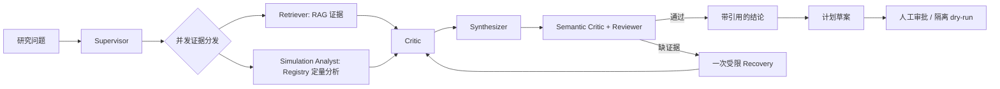

# MOOSE Research Copilot

面向 MOOSE 热防护仿真研究的证据约束多智能体 Copilot。它把已有 LHS case、参数、指标、日志、输入文件和报告写入 SQLite Registry，对论文和扫描件建立可追溯 RAG；LLM 只提出受限建议，程序验证证据和参数边界，人工审批决定是否进入隔离执行。



| 离线确定性评测 | 结果 |
| --- | --- |
| 多 Agent 工作流 | 29 / 30（96.67%） |
| 路由准确率 / Agent 路径覆盖 | 96.67% / 100% |
| 科研安全策略 | 9 / 9（100%） |
| 三方案消融：RAG / 工具 Agent / 多 Agent | 33.33% / 61.11% / 100% |

完整演示见 [docs/DEMO_CASES.md](docs/DEMO_CASES.md)：论文/OCR、文档与历史仿真联合分析，以及从知识缺口到人工审批的边界。

## 发布回归

`AgentTrace v1` 将同步 SSE、后台任务和最终结果统一到一个 `trace_id` 下；每个事件带节点、父 Span、状态与耗时。`tests/test_trace_contract.py` 约束该协议和“一次受限 Recovery”上限。最终回答还会返回 Claim-Evidence 验证：事实句必须可回溯到同一 Registry 工具结果或原始 EvidenceCard；证据不足、冲突、限制语和待审批计划会被明确区分，不把它们伪装成已验证事实。

普通 PR 运行 `.github/workflows/ci.yml`：编译、离线契约测试和版本化门禁，不依赖私有 MOOSE 工作区或本地模型。带有本机数据与 `scitime-agent` 环境的 self-hosted runner 每周或手动运行 `.github/workflows/full-regression.yml`，重新生成安全、Claim-Evidence、30 题工作流、120 题检索和路由报告，并与 `eval/baselines/deterministic-v1.json` 比较。工作流 P95 只告警；120 题默认 Dense 的 Source Recall、Page hit 与 P95 则是发布门禁。

任务调度默认是 SQLite 状态库加有界本地线程池；设置 `TASK_BACKEND=auto` 时会在 Redis/RQ 可达时自动改为共享队列，设置 `TASK_BACKEND=rq` 则在 Redis 不可用时直接失败，避免多实例部署误用本地队列。启动 Worker：

```bash
TASK_BACKEND=rq REDIS_URL=redis://127.0.0.1:6379/0 \
  conda run -n scitime-agent rq worker moose-research
```

## 快速开始

```bash
conda run -n scitime-agent python -m app.cli ingest
conda run -n scitime-agent python -m app.cli ask "early_1_2_rmse 最好的 case 是哪个"
conda run -n scitime-agent python -m app.cli analyze correlation --metric early_1_2_rmse
conda run -n scitime-agent python -m app.cli evaluate
conda run -n scitime-agent python -m app.cli collaborate "cpv_front_scale 对 early_1_2_rmse 有何影响，并说明历史报告依据"
conda run -n scitime-agent python -m app.cli compare
conda run -n scitime-agent python -m app.cli plan create --n-cases 1
# 审批后默认只生成隔离预览；--real 才会调用 MOOSE
conda run -n scitime-agent python -m app.cli plan approve <plan_id> --actor reviewer
conda run -n scitime-agent python -m app.cli plan execute <plan_id>
conda run -n scitime-agent uvicorn app.api:app --port 8010
# 通过 stdio 启动 MCP 服务，客户端配置见 mcp_config.example.json
conda run --no-capture-output -n scitime-agent python -m app.mcp_server
```

数据来源默认指向已有的 MOOSE LHS 工作区，可通过 `MOOSE_SOURCE_DIR` 覆盖。
阶段一不会修改来源目录，也不会启动新的 MOOSE 计算。

## 当前能力

- Simulation Registry：case 参数、指标、运行状态、产物和可追溯路径。
- 可配置检索：本地 BGE-M3 Dense、BM25、RRF Hybrid 与可开关 BGE Reranker；证据记录 chunk、行号、排名与检索耗时。
- 只读分析：Top-K case、参数-指标相关性、case 详情、失败日志搜索。
- 基础问答：对结构化问题调用分析工具，对知识问题返回带文件引用的检索证据。
- 22 题阶段一评测集与离线回归检查。
- 多 Agent：Supervisor、Retriever、Simulation Analyst、Critic、Synthesizer、Reviewer。
- 混合问题中检索与定量分析并发执行；最终结论区分文档证据、数据证据与因果局限性。
- 36 题三方案对比 Harness：纯 RAG、RAG + 数据工具、完整多 Agent。
- 受限 SimulationPlan、持久人工审批、隔离工作区、输入哈希、执行日志与失败分类。
- 默认 dry-run；只有已审批计划配合显式 `--real` 才会启动 MOOSE。
- 可选 LLM 层：实测 7B Coder 负责检索计划和证据整理，3B 用于低成本降级，通用 7B 保留给自然语言表达；所有模型输出必须通过 Pydantic 协议，不能绕过数值工具和引用来源。

## LLM 模型选型

复制 `.env.example` 为 `.env` 并确认 Ollama 可访问后，运行：

```bash
conda run -n scitime-agent python -m app.cli benchmark-models
```

基准对 `qwen2.5:3b`、`qwen2.5-coder:7b`、`qwen2.5:7b` 测试 Router/Evidence Agent 的 JSON 协议有效率与延迟。Router 优先使用 3B，失败后降级到 7B Coder；其 `RoutePlan` 仍会与规则安全下限合并，不能授权执行。`MOOSE_COPILOT_LLM_ENABLED` 默认关闭，以保持回归评测可复现。

## 检索消融

默认配置为 `RETRIEVAL_MODE=dense`、`CHUNK_STRATEGY=parent_child`，由扩展科学语料的页级评测选择。`hybrid_rerank` 仅作为离线精度实验，CPU 延迟不适合作为在线默认。运行：

```bash
conda run -n scitime-agent python -m eval.retrieval_eval
conda run -n scitime-agent python -m eval.end_to_end_retrieval_eval
```

前者比较 document/fixed/structure 切分与 BM25/Dense/Hybrid/Rerank，输出来源级 Recall@5、MRR、nDCG@5、P50/P95；后者在关闭 LLM 时比较它们接入 LangGraph 后的端到端工作流开销。详见 `reports/RAG_RETRIEVAL_ABLATION.md`。

## 科研多模态 RAG

`knowledge_sources/manifest.json` 是受版本控制的公开来源清单，管理 URL、访问许可和来源等级；原始 PDF、页图和解析缓存保留在被忽略的 `data/knowledge_sources/`。运行 `conda run -n scitime-agent python -m app.cli ingest-scientific` 下载并解析公开 PDF：优先用 PyMuPDF 文本层，扫描页再渲染后由 RapidOCR 提取，并记录页面、OCR 置信度和原图路径。该流程仅替换 `scientific:` 命名空间，绝不调用 `Registry.reset()` 或覆盖真实 MOOSE case。

检索证据卡会携带来源等级：A 为项目运行/输入证据，B 为项目报告，C 为公开科研资料，D 为 OCR/扫描资料。项目实际数值只能由 A/B 支撑；C/D 仅用于背景和机理，低置信 OCR 不应作为精确数字结论。多模态评测运行：

```bash
conda run -n scitime-agent python -m eval.scientific_multimodal_retrieval_eval --mode bm25 --chunk-strategy document
```

扩展科学语料采用页级 Dense 默认检索；来源 Profile 只作为证据展示和实验信号，绝不硬过滤候选。当前公开语料为 49 份来源（含 2 篇开放获取 MOOSE 方法论文）、1,016 页、1,613 个页级文档组和 2,234 个完整检索块，覆盖技术报告、会议论文、预印本、book chapter、演示资料、poster、扫描报告与期刊论文。`document_kind` 会随 EvidenceCard 传递，供工作台审阅和类型回归评测使用。120 条页级题上的默认 Local Dense Source Recall@5 为 86.94%、页命中率为 78.90%、P95 为 212.173 ms。BM25 仅用于明确的精确术语路由或 `fast` 档，`hybrid_rerank` 仅用于离线实验。可信度策略、扩容和选型记录见 `reports/STAGE3_RAG_SCALE_AND_CITATION.md`、`reports/RAG_PRODUCTION_HARDENING.md` 与 `reports/RETRIEVAL_OPTIMIZATION_V5.md`。

检索成本通过 `RETRIEVAL_TIER` 显式选择：`fast` 为 BM25、`default` 为 Dense、`precision` 为来源摘要融合。优化后的 `precision` 在 120 题上将 Source Recall@5 提升至 87.78%、Question hit 提升至 90.83%，P95 为 223.002 ms；默认仍取更稳的 Dense。精确英文术语的置信度路由只在离线评测验证后使用，不会因“表格”等泛词替换语义检索。指标、子集切片、路由对照和门禁定义见 `reports/RETRIEVAL_OPTIMIZATION_V5.md`。

## 复杂文档 RAG

科学 PDF 经过 `DocumentIR` 解析：PyMuPDF block+bbox、双栏阅读顺序、矢量表格 Markdown/CSV、OCR 页、section 与来源等级。默认 `parent_child` 用 BGE tokenizer 将子块限制为 384 token、64 token overlap；页和 section 仍是 Parent 引用。EvidenceCard 可在工作台中按需显示原始 PDF 页，并叠加 bbox 供人工核对。表格或 OCR 的低置信数值请求会进入 Reviewer 人工核对边界。完整解析、评测和选型依据见 `reports/COMPLEX_DOCUMENT_RAG.md` 与 `reports/STAGE3_RAG_SCALE_AND_CITATION.md`。

## 可切换 Milvus 向量索引

SQLite Registry 保留为 case、审批和原始证据的事实源；DocumentIR 保存 PDF 的页码、bbox、表格与 OCR 元数据。Dense Child vector 可通过 `VECTOR_BACKEND` 选择本地 Numpy 或 Milvus，Milvus 只保存 `chunk_id`、向量、来源过滤字段和内容哈希，命中后仍从 SQLite/DocumentIR 回填完整证据卡。

```bash
# 小语料、本地评测基线
VECTOR_BACKEND=local conda run -n scitime-agent python -m app.cli vector-status

# Milvus Standalone 或 Milvus Lite 已启动后，执行增量同步
VECTOR_BACKEND=milvus MOOSE_MILVUS_URI=http://127.0.0.1:19530 \
  conda run -n scitime-agent python -m app.cli vector-sync

# 本机 Milvus Lite 持久文件
VECTOR_BACKEND=milvus MOOSE_MILVUS_URI=data/milvus/scientific_chunks.db \
  conda run -n scitime-agent python -m app.cli vector-sync
```

每个 Child 以内容哈希单独缓存 BGE-M3 embedding；新文档只编码新增/变更 Child，Milvus 按 `chunk_id` 增量 upsert，并删除已不属于当前语料的旧 Child。Milvus 不可用时 Dense 自动使用本地 Numpy 缓存，EvidenceCard 和 SSE trace 会记录实际后端及降级原因。

在当前 2,234 chunk 对照中，Milvus Lite `FLAT + IP` 与 Local Numpy 的检索质量一致，但 Local P50/P95 为 180.706/225.397 ms，低于 Milvus Lite 的 1,226.955/1,305.651 ms；首次同步 2,234 vectors 用时 2,015.485 ms。Local 因而仍是默认在线后端；Milvus 用于更大 collection、增量 upsert、metadata filter 与多实例部署。详细对照见 `reports/STAGE3_RAG_SCALE_AND_CITATION.md`。

## 回答验证与并发任务

## LLM 多 Agent 协作

主图中的 Research Agent、Planner Agent 与 Semantic Critic 已接入受限 LLM 协议：模型分别进行跨证据归纳、参数关注项建议和语义审查；每个输出均通过 Pydantic、证据索引映射、参数白名单和确定性 Reviewer 校验。LLM 不拥有检索、审批或执行权限。多 Agent 对照与真实模型 smoke 结果见 `reports/LLM_MULTI_AGENT_COLLABORATION.md`。

最终回答由 `GroundedStatement` 组成：定量句绑定 Registry 工具来源，文档句只保留原始摘录并绑定 chunk 和行号，Critic 限制也独立标注。`eval/scientific_workflow_questions.jsonl` 包含 30 道科研工作流题，评测路由、Reviewer、句级链接、证据类型与关键结果词。

`POST /research/tasks` 创建持久后台任务，`GET /research/tasks/{task_id}` 查询状态，`POST /research/tasks/{task_id}/cancel` 发出取消请求，`GET /observability` 返回任务队列与延迟统计。执行中的本地模型调用不会被不安全地强制中断；取消状态会被持久记录。

每个研究请求现在返回 `AgentTrace v1`：Trace/Span、父子关系、Agent 节点、路由决策、Reviewer 状态和节点耗时共用同一个 `trace_id`。`/research/stream` 实时发送同一规范事件；后台任务完成后可通过 `GET /research/tasks/{task_id}/trace` 获取可回放时间线与摘要。Trace 仅记录受限摘要和工具决策，不将模型候选内容提升为事实结论。

## Recovery 与资源隔离

Reviewer 发现 `citation_coverage`、`missing_retrieval` 或 `no_evidence` 时，会转入一次受限 Recovery：只能调整来源过滤、报告优先重试或补检索，不能修改数值结论。仍无法支持的问题会明确拒绝。含“下一轮/候选仿真建议”的问题只生成未持久化的 `SimulationPlan` 草案，仍需走人工审批接口。

`/research/stream` 在 LangGraph 节点完成时实时发送 SSE 事件。Embedding、Reranker、LLM 分别由进程内有界信号量控制；`/observability` 返回其排队指标。运行默认模型压测：

```bash
conda run -n scitime-agent python -m eval.concurrency_smoke --users 5 --mode dense
```

Supervisor 还会声明 `EvidenceRequirement`，分别验收 Registry、报告、日志、状态表、输入 deck 和脚本；缺失类型触发一次受限补检索。探索性计划草案基于相关性方向生成差异化候选，必须调用 `POST /plans/drafts/confirm` 才会进入待审批状态。完整实验结果见 `reports/EVIDENCE_CONTRACT_PLAN_ADVISOR_AND_QOS.md`。

## 知识缺口、绘图与 MCP

当问题明确指出历史数据未覆盖的新工况、参数组合或验证需求时，系统先给出知识缺口诊断，再按参数白名单、边界和历史相关性生成未持久化的探索性 `SimulationPlan` 草案。草案必须经显式确认写入 `pending`，再由人工审批；默认执行仍是隔离 dry-run，不能将 dry-run 或环境失败写成科学结论。

`POST /plots/scatter`、`/plots/correlation`、`/plots/ranking` 生成的图片会保存在 `data/artifacts`，每个返回都携带数据来源、筛选条件、样本数和科学局限性。工作台会显示知识缺口、审批草案和图表产物。

`app.mcp_server` 使用标准 stdio MCP 协议提供 9 个受限工具：证据检索、相关性分析、三种科研绘图、实验草案创建/确认、已审批计划的 dry-run 预览和结果报告。它不提供任意 SQL、任意 Python 或真实 MOOSE 执行工具。客户端可直接采用 `mcp_config.example.json`。
